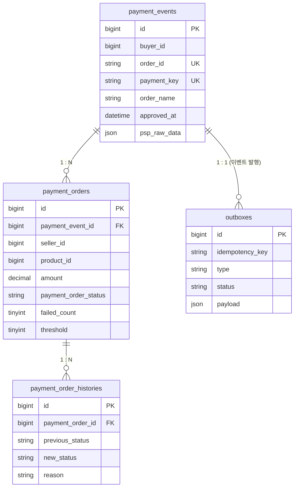
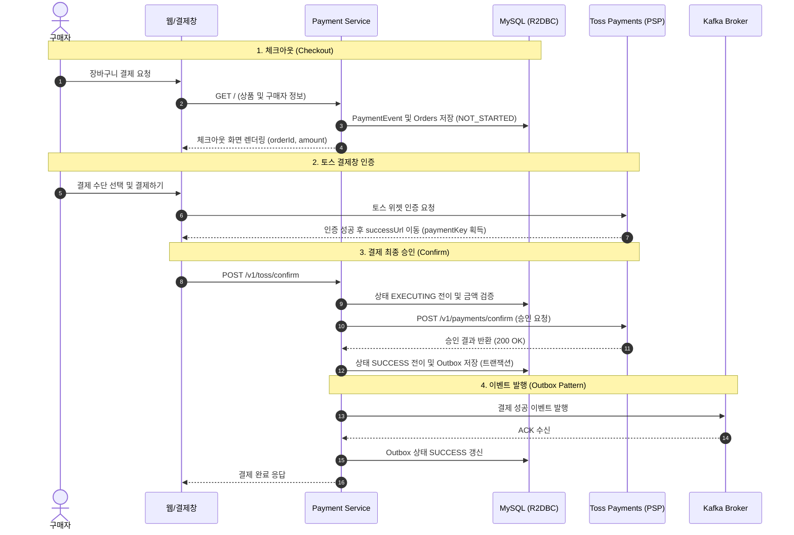

# Payment Service (결제 시스템 구축)

토스페이먼츠(Toss Payments) 연동 기반의 대규모 트래픽 및 정합성을 고려한 비동기 결제 서비스 프로젝트입니다.

---

## 1. 프로젝트 개요

이 프로젝트는 이커머스 환경에서 발생할 수 있는 결제 트래픽을 안전하고 효율적으로 처리하기 위해 다음과 같은 핵심 요구사항을 충족하도록 설계되었습니다.

- Non-blocking 비동기 I/O를 통한 고성능 동시성 처리
- 멱등성(Idempotency) 보장을 통한 중복 결제 및 중복 차감 방지
- 클라이언트 위변조 방지를 위한 결제 금액 무결성 검증
- 트랜잭셔널 아웃박스(Transactional Outbox) 패턴을 통한 이벤트 발행 원자성 보장
- 타임아웃 및 네트워크 오류 발생 시 자동 장애 복구(Recovery/Reconciliation)

---

## 2. 기술 스택 및 아키텍처

### 기술 스택
- Language: Kotlin 2.1 (JVM 17)
- Framework: Spring Boot 3.5.x, Spring WebFlux
- Reactive Stream: Project Reactor
- Database: MySQL, Spring Data R2DBC
- Event Streaming: Spring Cloud Stream, Spring Cloud Stream Binder Kafka Reactive
- HTTP Client: Spring WebClient
- Test: JUnit 5, Reactor Test, MockK

### 아키텍처 구조 (Hexagonal Architecture)
포트 및 어댑터(Ports and Adapters) 패턴을 적용하여 도메인 비즈니스 로직과 외부 인프라(DB, PG사, 메시지 브로커)를 격리하였습니다.

```
src/main/kotlin/com/example/paymentservice/
├── common/                  # 공통 어노테이션, 유틸리티, 로거
└── payment/
    ├── domain/              # 순수 비즈니스 엔티티 및 도메인 로직
    ├── application/
    │   ├── port/
    │   │   ├── in/          # 인바운드 유스케이스 인터페이스 (Checkout, Confirm, Recovery 등)
    │   │   └── out/         # 아웃바운드 포트 인터페이스 (DB, PG, Kafka 연동 등)
    │   └── service/         # 비즈니스 오케스트레이션 서비스
    └── adapter/
        ├── in/
        │   └── web/         # 컨트롤러 (HTML 뷰 및 REST API)
        └── out/
            ├── persistent/  # R2DBC 기반 데이터베이스 어댑터
            ├── web/         # 토스페이먼츠 연동 WebClient 어댑터
            └── stream/      # Kafka 이벤트 메시지 발행 어댑터
```

---

## 3. 데이터 모델

결제 데이터는 결제 트랜잭션 전체 단위인 `PaymentEvent`와 개별 상품/판매자별 주문 단위인 `PaymentOrder`로 분리되어 1:N 관계를 가집니다.



- **payment_events**: 전체 결제 건을 식별하며, PG사 승인 정보(`payment_key`, `approved_at`, `psp_raw_data`)를 관리합니다.
- **payment_orders**: 결제 건에 포함된 개별 상품 및 판매자(`seller_id`) 정보와 결제 상태, 재시도 임계값을 관리합니다.
- **payment_order_histories**: 결제 상태 변경 이력(`NOT_STARTED` -> `EXECUTING` -> `SUCCESS`/`FAILURE`)을 기록합니다.
- **outboxes**: Kafka 이벤트 발행의 원자성을 보장하기 위한 아웃박스 테이블입니다.

---

## 4. 전체 결제 처리 흐름



---

## 5. 핵심 신뢰성 및 장애 복구 메커니즘

1. **멱등성(Idempotency) 및 중복 결제 차단**
   - 요청 본문 데이터를 기반으로 고유한 `orderId`를 생성하여 DB 유니크 제약 조건을 설정합니다.
   - 결제 승인 진입 시 이전 상태가 이미 `SUCCESS` 또는 `FAILURE`인 경우 `PaymentAlreadyProcessedException`을 발생시켜 중복 실행을 차단합니다.

2. **트랜잭셔널 아웃박스 패턴 (Transactional Outbox Pattern)**
   - RDB에 결제 상태를 `SUCCESS`로 저장하는 트랜잭션 내에 `outboxes` 테이블에 이벤트를 함께 저장합니다.
   - 트랜잭션 커밋 후 Kafka로 발행하며, 발행 실패 시 백그라운드 스케줄러(`PaymentEventMessageRelayService`)가 주기적으로 재발행합니다.

3. **자동 장애 복구 (Payment Recovery Service)**
   - 네트워크 단절, 타임아웃 등으로 `EXECUTING` 또는 `UNKNOWN` 상태로 남아있는 결제 건을 `PaymentRecoveryService` 스케줄러가 주기적으로 조회합니다.
   - Bulkhead 패턴 및 WebFlux 병렬 처리를 통해 메인 트래픽에 영향 없이 토스페이먼츠와 대조하여 최종 상태를 정합성에 맞게 동기화합니다.

---

## 6. 상세 문서 목록

프로젝트의 설계 및 단계별 구현 문서는 `docs` 디렉토리에서 확인할 수 있습니다.

- [01. Toss Payments 연동하기](/docs/01_link_to_the_payment_of_toss_payments.md)
- [02. Payment Service 데이터 모델링](/docs/02_Payement_Sevice_data_modeling.md)
- [03. 가상의 checkout 기능 구현하기](/docs/03_Implementing_a_Mock_Checkout.md)
- [04. 결제 승인 기능 구현하기](/docs/04_Implementing_Payment_Approval.md)
- [05. 결제 승인 에러 핸들링](/docs/05_Handling_Payment_Approval_Errors.md)
- [06. 결제 복구 서비스](/docs/06_Payment_recovery_service.md)

