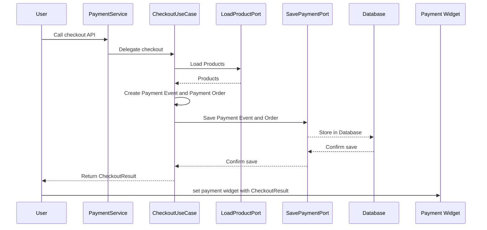

# 가상의 checkout 기능 구현하기

## Checkout 기능이 필요한 이유는?

Checkout 기능은 사용자가 제품을 구매하기 위해 결제를 요구하는 기능을 말한다.   
결제를 요구하는 이벤트가 있어야 결제 서비스가 결제를 할텐데 지금 우리 시스템에서는 이 기능이 없다.

그래서 가상의 Checkout 기능이 필요하다.  
이 프로젝트에서는 결제 서비스에 초점을 맞추기 위해, 제품을 보여주고 장바구니에 담는 기능은 만들지 않을 예정이다.  
따라서, 결제 페이지가 보여질 때 이미 장바구니에 제품이 담겨 있다고 가정하고, Checkout 기능을 진행하겠습니다.

- **(1) User → PaymentService**: 결제 페이지가 호스트 될 때 Checkout API 를 호출한다.
- **(2) Payment Service → CheckoutUseCase**: PaymentService 는 Checkout 기능을 CheckoutUseCase 에게 위임한다.
- **(3) CheckoutUseCase → LoadProductPort**: 장바구니에 담긴 상품 아이디를 가지고 상품 정보를 불러온다.
- **(4) CheckoutUseCase Business Logic**: 가져온 상품 정보를 바탕으로, Payment Event 와 Payment Order 를 생성한다.
- **(5) CheckoutUseCase ↔ SavePaymentPort**: 생성한 Payment Event 와 Payment Order 를 데이터베이스에 저장한다.
- **(6) CheckoutUseCase → User**: CheckoutResult 결과를 사용자에게 전달한다.
- **(7) User → Payment Widget**: CheckoutResult 를 이용해서 결제 위젯에 결제 정보를 세팅한다. (e.g orderId, amount 등)

### Error Scenario: Checkout 기능을 연속으로 사용자가 호출한다면?

구매하기 버튼을 연속으로 두 번 눌러서 Checkout API 가 여러번 호출되는 일이 발생하면 어떤 일이 생길까?  
호출된 API 수 만큼 Payment Event 와 Payment Order 가 만들어 지는 건 적절하지 않아 보인다. 그러므로 여러 번 호출되더라도 하나의 Payment Event 가 생성되도록 보장해야한다.

이를 가능하게 하는 것은 **결제 주문 아이디 (= orderId) 이다**. Checkout API를 호출할 때 사용되는 **요청 본문 데이터**를 바탕으로 **고유한 orderId**를 생성하고, 이를 이용해서 Payment Event를 생성한다고 가정해보자. 그렇게 되면, 여러 번 요청을 하더라도 단 한 번의 Payment Event만 생성된다. 이후의 요청들은 데이터베이스의 무결성 제약으로 인해 실패하기 때문에 여러개의 Payment Event가 생성되는 것을 방지할 수 있다.