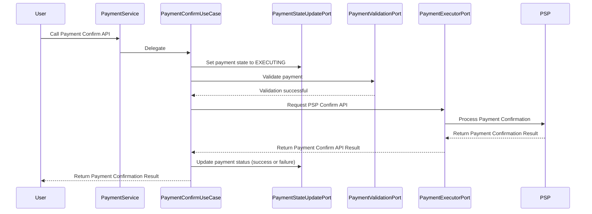

# 결제 승인 기능 구현하기

## 결제 승인 과정이란?

결제 승인 과정은 사용자가 결제 창에서 결제 정보를 입력하고 인증한 후에, 결제 서버 측에서 PSP 로 결제 승인을 보내는 과정을 말한다.

## 결제 승인 Sequence Diagram

다음 Sequence Diagram 과정대로 결제 승인 처리는 완료될 것이다.

- **(1) User → PaymentService:** 구매자는 PaymentService 로 결제 승인 요청을 전달한다.
- **(2) PaymentService → PaymentConfirmUseCase:** Payment Service 는 결제 승인 작업을 Payment ConfirmUseCase 에게 위임한다.
- **(3) PaymentConfirmUseCase → PaymentStateUpdatePort**: 결제 승인의 시작을 알리기 위해서 Payment 의 상태를 NOT_STARTED → EXECUTING 상태로 변경
- **(4) PaymentConfirmUseCase → PaymentValidatorPort**: 결제에 대한 유효성 검사. (e.g 금액 등)
- **(5) PaymentConfirmUseCase → PaymentExecutorPort**: PSP 에 결제 승인을 요청한다.
- **(6) PaymentConfirmUseCase → PaymentStateUpdatePort**: PSP 결제 승인 결과에 따라서 결제 완료/실패  상태를 저장
- **(7) PaymentConfirmUseCase → User**: 결제 승인 결과를 사용자에게 전달한다.