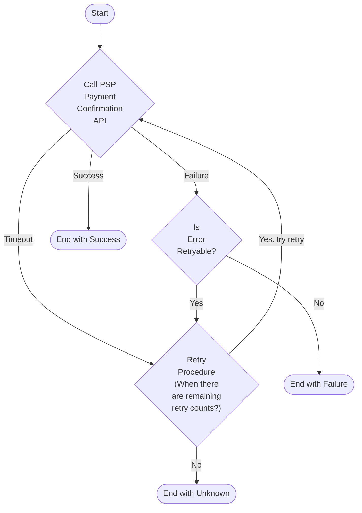

# 결제 승인 에러 핸들링

## Toss Payments 결제 승인에서 발생할 수 있는 에러

결제 승인에 실패하면 관련 HTTP 상태 코드와 함께 에러 객체가 반환된다.

```json
{
  "code": "NOT_FOUND_PAYMENT",
  "message": "존재하지 않는 결제 입니다."
} 
```


자세한 토스 API 에러 코드는 다음 주소에서 확인 할 수 있다.

[토스 API에러 코드](https://docs.tosspayments.com/reference/error-codes#%EA%B2%B0%EC%A0%9C-%EC%8A%B9%EC%9D%B8)

결제 승인과 관련된 에러를 처리할 때 중요한 건 **“재시도 가능 유무”** 이다.

**“REJECT_ACCOUNT_PAYMENT (잔액 부족)”** 와 같은 에러는 재시도 할 수 없는 명백한 결제 실패 유형 에러지만 **“PROVIDER_ERROR (일시적 오류 발생)”** 와 같은 일시적인 에러는 재시도를 통해서 해결할 수 있다.

## 재시도를 하면 여러번 결제가 될까?

Toss Payments 에서는 같은 결제를 두 번 요청하게 되면 **“ALREADY_PROCESSED_PAYMENT (이미 처리된 결제 입니다)”** 에러가 발생한다.

결제 승인 요청은 멱등성을 보장해서 여러 번 요청을 해도 동일한 응답을 받을 수 있다. 이를 위해 요청 헤더에 아래의 멱등성 키-값을 추가하면 된다.

```
Idempotency-Key: {IDEMPOTENCY_KEY}
```

## 결제 승인 에러 핸들링과 재시도



## 재시도는 어떻게 해야할까?

결제 승인 에러를 확인하고 재시도는 어떻게 해야할까?

재시도를 적용할 때 고려해야 할 사항은 다음과 같다:

- 지수 백오프(Exponential Backoff)
- 재시도 제한 횟수(Retry Limited Count)
- 지터(Jitter)

**Exponential backoff**:

- 재시도 사이에 일정 시간 지연을 설정하는 것이다. 서버가 과부하로 인해 응답을 전달하지 못하는 경우를 대비해서 일정시간 지연을 주는 것이 필요하다.
- 지연 시간은 재시도마다 지수적으로 증가한다. 예를 들면, 첫 번째 재시도에는 1초 동안 대기하고, 두 번째 재시도에는 2초 대기, 세 번째 재시도에는 4초 대기, 네 번째 재시도에는 8초 이렇게 대기하게된다.

**jitter:**

- 요청이 동시에 재시도 되지 않도록 Exponential backoff외에 무작위 지연을 추가적으로 부여하는 것이다.
- jitter가 없다면 요청들이 동시에 재시도 되면서 특정 시간의 주기에만 트래픽이 급증하는 문제가 생길 수 있다. 이 문제에 대해 좀 더 자세하게 설명하자면, 네트워크 요청이나 서버에 대한 쿼리가 실패했을 때, 클라이언트는 일반적으로 연속적인 실패를 방지하고 성공할 때까지 요청을 다시 시도하게 된다. 이때 재시도 간 일정한 간격을 두고 요청을 반복하게 되는데, 만약 많은 클라이언트가 동시에 같은 패턴으로 재시도를 한다면, 서버에 동시에 높은 부하가 발생하여 서버의 성능 저하나 다운타임을 초래할 수 있게 된다.

**Retry Limited Count:**

- 재시도를 수행하는 최대 횟수를 의미한다. 제한 횟수가 설정되어 있지 않으면 무한적으로 재시도하며 자원을 소모할 것이므로 횟수를 지정하는게 중요하다.

## 타임아웃 설정

타임아웃에는 크게 두 가지 유형이 있다.

- 연결 타임아웃(Connection Timeout): 서버와의 연결을 시도할 때까지의 시간을 말한다.
- 요청 타임아웃(Request Timeout): 요청을 보낸 후 서버로부터 응답을 받기까지의 시간을 말한다.

타임아웃을 설정하지 않으면 서버로부터 응답을 무한히 기다려야 하므로, 이 기간 동안 리소스가 점유되는 문제가 발생한다. 서버를 안전하게 보호하고 리소스를 효율적으로 관리하기 위해서는 타임아웃 설정이 필요하다.

타임아웃은 얼마로 설정하는 것이 좋을까?

타임아웃을 너무 높게 설정하면 그 시간 동안 리소스가 점유되는 문제가 있다.  
반면, 타임아웃을 너무 낮게 설정하면 응답이 도착할 가능성이 있는데도 불구하고, 타임아웃으로 인해 응답을 받지 못하는 상황이 발생할 수 있다.  


적절한 타임아웃 설정은 사용 환경과 통신하는 API 특성에 따라 달라지는 것이 좋다. 
예를 들어, 자신의 서버와 같은 환경에서 네트워크 통신이 많은 다른 서버가 이웃으로 배포되어 있다면 네트워크 대역폭을 고려해 타임아웃을 좀 더 높게 설정해볼 수 있다. 
또 통신하는 API 가 복잡한 연산을 요구하고 응답이 오래 걸리는 경우에도 타임아웃을 높게 설정하는 것이 바람직하다.