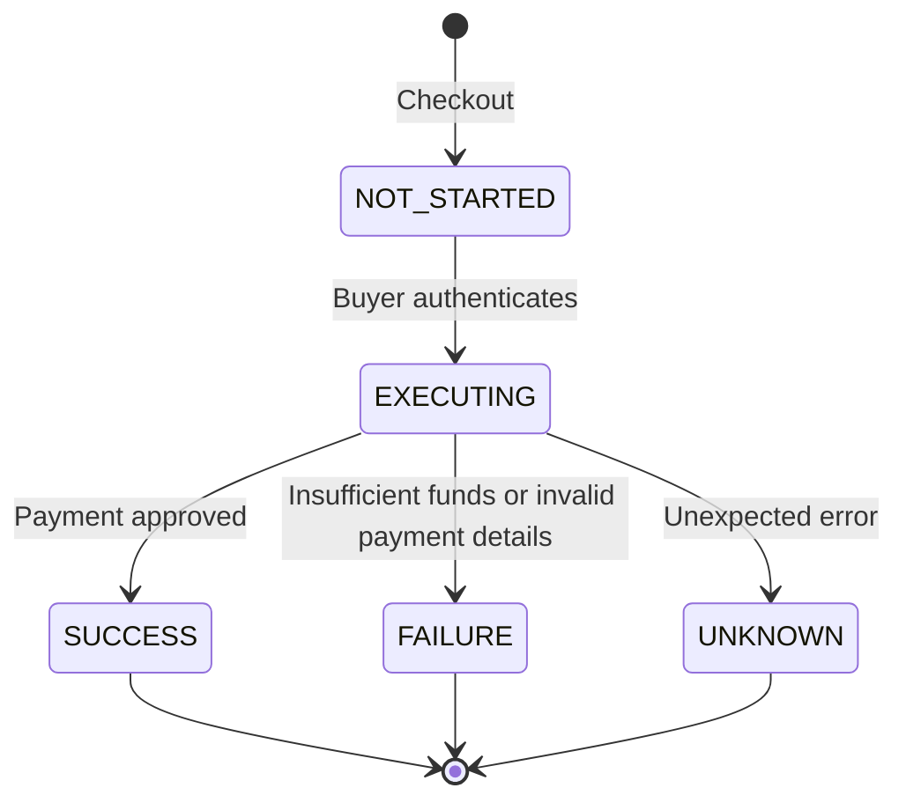
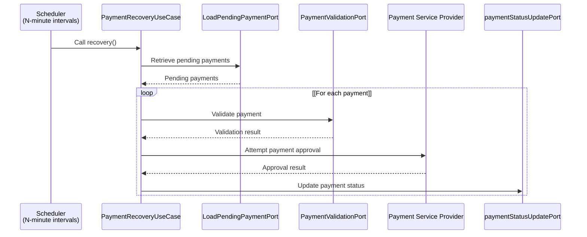
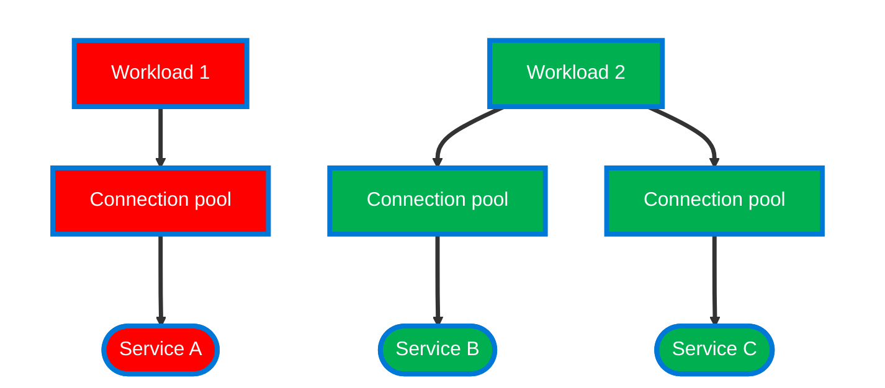

# 결제 복구 서비스

## 처리가 지연되고 있는 결제는 발생할 수 있다

다음과 같이 처리가 지연되고 있는 결제는 발생할 수 있다.

- 알 수 없는 예러로 결제 서비스가 갑자기 종료되는 경우
- PSP 에서 일시적인 결제 오류가 발생한 경우
- 어플리케이션이 새로 배포되면서 결제 처리 중인 어플리케이션이 죽는 경우

## 결제 복구 서비스는 어떻게 동작해야할까?

결제 상태는 다음과 같다:

- **NOT_STARTED**: 결제가 만들어진 초기 상태
- **EXECUTING**: 사용자가 PSP 페이지에서 결제 인증을 거친 후 결제 승인이 시작되는 상태
- **SUCCESS**: 결제 승인이 성공된 상태
- **FAILURE**: 결제 승인이 실패된 상태
- **UNKNOWN**: 결제 승인을 모르는 상태 혹은 알 수 없는 예외로 실패한 상태.

복구가 필요한 상태는 어떤 상태들일까?

- EXECUTING 상태
- UNKNOWN 상태

EXECUTING 상태에서 변하지 않으면 결제가 중단된 상태일 수 있으며,   
결제 승인 여부를 알 수 없는 UNKNOWN 상태 역시 정상적인 상태가 아니다.

# 결제 복구 서비스 (feat: Bulk Head, Parallel, Alerting)

## Goal

결제 복구 기능을 개발해보자.

## 처리가 지연되고 있는 결제는 발생할 수 있다

다음과 같이 처리가 지연되고 있는 결제는 발생할 수 있다.

- 알 수 없는 예러로 결제 서비스가 갑자기 종료되는 경우
- PSP 에서 일시적인 결제 오류가 발생한 경우
- 어플리케이션이 새로 배포되면서 결제 처리 중인 어플리케이션이 죽는 경우

## 결제 복구 서비스는 어떻게 동작해야할까?

결제 상태는 다음과 같다:

- (1) **NOT_STARTED**: 결제가 만들어진 초기 상태
- (2) **EXECUTING**: 사용자가 PSP 페이지에서 결제 인증을 거친 후 결제 승인이 시작되는 상태
- (3) **SUCCESS**: 결제 승인이 성공된 상태
- (4) **FAILURE**: 결제 승인이 실패된 상태
- (5) **UNKNOWN**: 결제 승인을 모르는 상태 혹은 알 수 없는 예외로 실패한 상태.

!Untitled

복구가 필요한 상태는 어떤 상태들일까?

- EXECUTING 상태
- UNKNOWN 상태

EXECUTING 상태에서 변하지 않으면 결제가 중단된 상태일 수 있으며, 결제 승인 여부를 알 수 없는 UNKNOWN 상태 역시 정상적인 상태가 아니다.

## 결제 복구 서비스 Sequence Diagram

결제 복구 서비스의 Seqeunce Diagram 은 다음과 같을 것이다.

1. **Scheduling → PaymentRecoveryUseCase**: N분을 주기로 PaymentRecoveryUseCase 의 recovery() 메소드를 호출한다.
2. **PaymentRecoveryUseCase → LoadPendingPaymentPort**: Pending 상태의 Payment Event 들을 가지고 온다.
3. **PaymentRecoveryUseCase → PaymentValidationPort**: Payment 의 유효성 검사를 요청한다.
4. **PaymentRecoveryUseCase → PSP**: PSP 로 결제 승인을 요청한다.
5. **PaymentRecoveryUseCase → PaymentStatusUpdatePort**: PSP 결제 승인 결과에 따라서 Payment 상태를 데이터베이스에 업데이트한다.

### 계속 실패되는 결제는 어떻게 해야할까?

PaymentRecoveryUseCase 는 기본적으로 “재시도” 를 통해 문제를 해결한다. 그러나 충분한 재시도로도 해결되지 않는 문제가 생길 수 있다. 이런 경우에는 어떻게 대응해야할까?

문제가 재시도를 통해 해결되지 않을 경우, 실패 횟수를 증가시키고, 이 횟수가 특정 기준을 초과하면 재시도로 해결되지 않았다고 알람을 발생시키고 이후에 개발자가 수동으로 대응할 수 있도록 하자.

## 결제 복구 서비스 고려사항

### Bulk Head Pattern 적용하기

Bulk Head Pattern 은 시스템의 신뢰성을 높이기 위해 사용되는 패턴이다. 이 패턴의 주 목적은 하나의 작업이 실패하더라도, 다른 작업에 영향을 주지 않게 함으로써 신뢰성을 보장하는 것이다.

이는 각 작업의  Workload 마다 사용되는 리소스를 분리함으로써 실현된다. 

예를 들어, 아래의 그림에서 Service A 의 작업에 문제가 생겨 Workload 1 의 Connection Pool 리소스가 소모되더라도, Workload 2 의 리소스들이 사용되는 것은 아니라서 Workload 2 의 리소스는 영향을 받지 않는다. 그러므로 Workload 2 는 정상적으로 작동할 수 있다.

PaymentRecoveryUseCase 에서 BulkHead Pattern 을 적용함으로써, Recovery 에 사용되는 스케줄러를 다른 서비스들과 분리해서 사용할 수 있다.

### Scalability 고려하기

결제 시스템을 운영할 땐 아마 단일 서버 인스턴스로 사용하지 않을 것이다. 확장성을 위해 여러 결제 서비스 인스턴스가 배포될텐데, 이 경우 각 서비스가 동일한 Pending 상태의 결제를 중복 처리 문제가 발생할 수 있다.

중복 처리는 확장성 부족이라는 문제를 야기할 수 있다. 시스템의 확장성은 매우 중요한 하므로, 이 문제를 어떻게 해결할 수 있을까?

근본적인 해결책은 파티셔닝(Partitioning) 이다. 즉, 각 결제 서비스가 복구해야 하는 결제를 나눠서 처리하는 것이다. 파티셔닝의 구현 방법은 배포되는 환경에 따라 달라질 수 있다. 예를 들어, 쿠버네티스 환경에서라면 StatefulSets 을 이용해서 각 서버마다 인스턴스 번호를 할당받고, 이 번호를 기반으로 결제를 조회해서 파티셔닝 처리를 하면 된다.

### 병렬 처리하기

Spring Webflux 와 같은 비동기 논블로킹 시스템에서는 API 요청과 같은 외부 통신을 병렬로 처리하는 것이 훨씬 성능에 유리하다. API 호출과 같은 I/O 작업이 대기 상태에 있을 때, 스레드가 블록되지 않고 다른 작업을 처리할 수 있으며, 동시에 많은 수의 연결을 효율적으로 관리할 수 있고 각 연결에 대해 별도의 스레드를 할당할 필요가 없기 때문이다.

물론 병렬 처리가 가능한 작업인지, 동시성 문제가 없는지, 통신 대상 서버에 과도한 트래픽이 집중되지는 않는지 등을 고려해야한다.