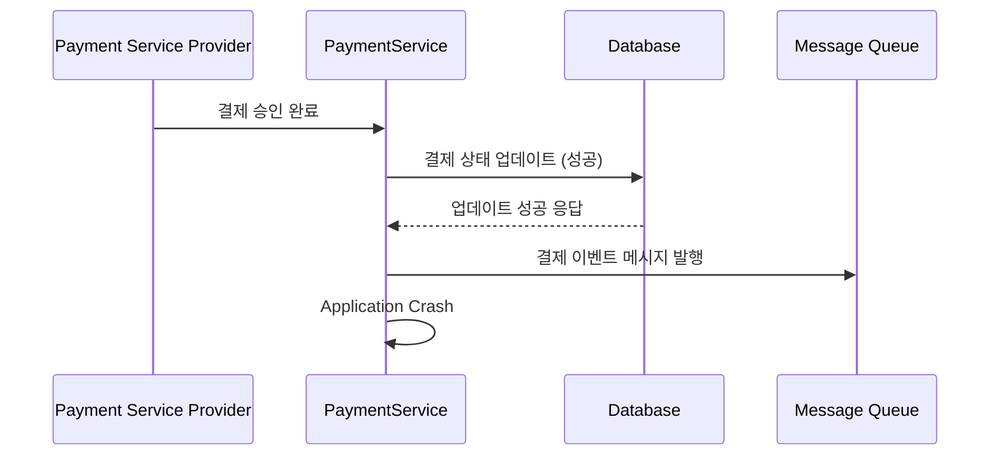
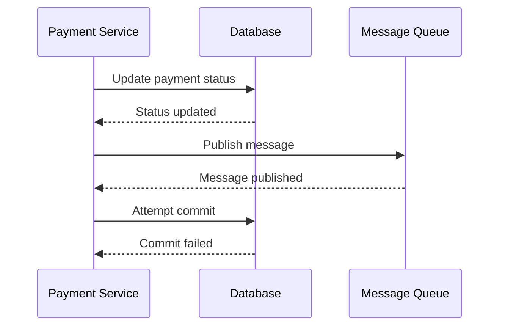
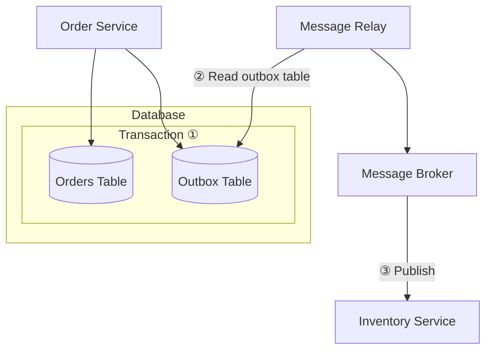
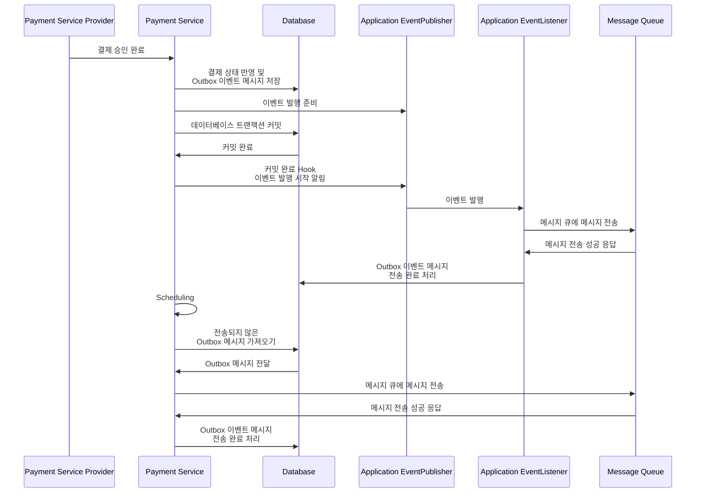

# 결제 승인 메시지 발행 (feat: Transactional Outbox pattern, Apache Kafka) 이론

## 결제 승인 메시지 발행이 필요한 이유

PSP 에서 결제 승인이 성공된 다음 결제를 완전히 마무리하기 위해서는 2가지 스텝의 처리가 더 필요하다:

- **Wallet Service**: 판매자에게 지불할 금액을 정산해야한다.
- **Ledger Service**: 결제 내역을 장부에 기록해야한다.

물론 Payment Service 가 Wallet Service 와 Ledger Service 를 각각 호출해서 처리를 지시하고 결제를 완료해도 된다.  
이 경우에는 이벤트 메시지 발행이 필요 없을 것이다.

하지만 이런 처리 방식은 Payment Service 가 Wallet Service 와 Ledger Service 존재를 **‘알아야 하는’** 문제가 생긴다. 즉 결합도가 높아진다.

장기적으로 볼 때 결제 승인 성공 후에 이에 대한 후속 처리 서비스는 점점 늘어날 수 있기 때문에 이벤트 기반의 느슨한 결합 통신 방식이 더 적합해 보인다.  
Payment Service 는 단순히 결제 승인 이벤트를 발행하면 되고, 새롭게 추가되는 서비스들은 단순히 이벤트를 수신해서 처리하면 되므로.  
이벤트 메시지를 발행하기 위한 서비스들은 많지만 여기서는 그 중 가장 대표적인 Apache Kafka 를 사용해보겠다.

## 안전하게 메시지를 발행하는 방법

결제 승인 완료 이벤트를 발행하지 못하고 어플리케이션이 갑자기 종료되면 어떻게 될까? 메시지 유실 문제가 발생한다.

메시지가 유실되면 Wallet Service 와 Ledger Service 는 결제 후속 처리를 할 수 없으므로 결제 처리는 완료될 수 없다.  
따라서 메시지를 반드시 성공적으로 전달해야한다. 이를 위한 방법은 무엇일까?   
가장 직관적인 방법은 데이터베이스에 결제 상태를 업데이트 하는 트랜잭션에 결제 이벤트 메시지 발행도 포함시키는 것이다.   
이 방법은 이벤트 메시지 발행이 실패할 경우 결제 상태도 업데이트 되지 않는다. 그러나 이 방법은 메시지 발행은 롤백 할 수 없다는 문제점이 있다.  
결제 상태도 업데이트 하고, 메시지 발행도 한 이후에 데이터베이스에 커밋을 보냈는데 실패하는 경우를 생각해보면 된다.  
데이터베이스에 반영한 결제 상태는 정상적으로 롤백 되겠지만 메시지 큐에 보낸 메시지는 회수할 수 없다.

데이터베이스에 업데이트와 동시에 메시지를 안전하게 전송하는 방법으로 Transactional Outbox Pattern 이 있다.  
Transactional Outbox Pattern 은 메시지 큐에 발행할 이벤트 메시지를 트랜잭션에  포함시켜 함께 저장하는 방식이다.  
이렇게 저장한 이후에 Message Relay 는 주기적으로 메시지를 읽어서 메시지 큐에 전송한다.  
이 방법은 데이터베이스 트랜잭션을 이용해서 결제 상태 반영과 이벤트를 일관되게 반영할 수 있는 방법이다. 

Transactional Outbox Pattern 을 적용하는 방법은 크게 두 가지가 있다:

- CDC (Change Data Capture) 를 이용하는 것.
- Outbox 테이블을 조회해서 메시지를 발행하는 것.

Outbox 테이블을 조회하는 방법은 데이터베이스에 부하를 주는 반면에 CDC 를 이용한 데이터베이스 로그 파일을 읽어서 메시지를 전달하는 방법이 더 효율적이다.  
그러나 여기서는 Transactional Outbox Pattern 을 구현하기 위해서 Outbox 테이블을 직접 조회해서, 해당 내용으로 메시지를 발행하는 방법을 사용할 것이다.

## 메시지 발행 Sequence Diagram

크게 두 가지 흐름이 있다.

- (1) 주기적으로 Database 의 Outbox 테이블에서 전송되지 않은 이벤트 메시지들을 조회해서 메시지 큐에 보내는 흐름
- (2) 기존 결제 승인 Flow 에서 결제 상태가 성공으로 업데이트 될 때 메시지 큐에 메시지를 전달하는 흐름

## Outbox 테이블 모델링

| name            | type                               | description         |
|-----------------|------------------------------------|---------------------|
| id              | PK, BIG INT, AUTO_INCREMENT        | Outbox 테이블을 식별하는 PK |
| idempotency_key | VARCHAR(255), UNIQUE               | 멱등성 키               |
| status          | ENUM(’INIT’, ‘FAILURE’, ‘SUCCESS’) | 메시지 전송 상태           |
| type            | VARCHAR(40)                        | 이벤트 메시지 타입          |
| partition_key   | INT                                | 메시지 큐의 파티셔닝 키       |
| payload         | JSON                               | 이벤트 메시지 본문          |
| metadata        | JSON                               | 메타 데이터              |