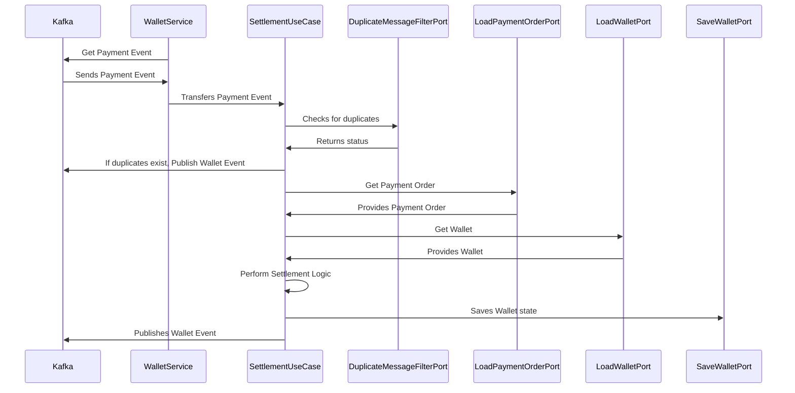

# Wallet Service 구축

## Overview

구매자가 전자상거래 업체에서 상품을 구매하고 결제하면, 해당 금액은 즉시 판매자에게 정산되지 않는다.  
결제 금액은 먼저 결제 서비스 제공업체(PSP)로 이동한 뒤, PSP에서 전자상거래 회사의 법인 계좌로 전송되고. 이후, 전자상거래 회사는 판매자에게 해당 금액을 정산한다.

## 데이터 모델링

### Wallets

| name | type | description  |
| --- | --- | --- |
| id | PK, BIG INT, AUTO INCREMENT | 지갑의 고유 식별자 |
| user_id | BIG INT, UNIQUE | 지갑 소유자의 식별자 |
| balance  | DECIMAL | 지갑의 현재 잔액 |
| version | INT | 지갑의 버전 정보. 주로 동시성 제어에 사용 |
| created_at | DATETIME | 생성된 날짜 |
| updated_at | DATETIME | 업데이트된 날짜  |

### Wallet Transactions

| name | type | description |
| --- | --- | --- |
| id | PK, BIG INT, AUTO INCREMENT | 거래의 고유 식별자 |
| wallet_id | FK, BIG INT | 거래가 발생한 지갑의 식별자 |
| amount | DECIMAL | 거래 금액 |
| type | ENUM(’CREDIT’, ‘DEBIT’) | 거래 유형, 지갑에 자금이 추가되는 경우 CREDIT, 자금이 차감되는 경우 DEBIT |
| reference_type | VARCHAR | 거래가 참조하는 엔터티 유형 (e.g ‘주문’, ‘환불’ 등)  |
| reference_id | BIG INT  | 거래가 참조하는 외부 엔터티 식별자 |
| order_id | VARCHAR | 거래와 관련된 결제 주문 식별자 |
| idempotency_key | VARCHAR | 중복 거래 삽입을 막기위한 멱등성 식별자 |
| created_at | DATETIME | 생성된 날짜 |
| updated_at | DATETIME | 업데이트된 날짜  |

## Sequence Diagram

- 1 **Kafka ↔ WalletService**: Wallet Service 에서는 Kafka 로부터 결제 승인 완료를 알리는 PaymentEventMessage를 받는다.
- 2 **WalletService → SettlementUseCase**: Wallet Service는 정산 처리를 SettlementUseCase 에 위임한다.
- 3 **SettlementUseCase → DuplicateMessageFilterPort:** 중복 이벤트 메시지로 인한 여러 번 정산을 방지하기 위해 이벤트 메시지가 이미 처리되었는지 확인한다.
- 4-1 **SettlementUseCase → Kafka:** 이미 처리된 이벤트 메시지인 경우, 정산 처리를 건너뛰고 WalletEventMessage 를 Kafka 에 발행한다.
- 4-2 **SettlementUseCase → LoadPaymentOrderPort**: 처음 받는 이벤트 메시지라면, 정산 처리를 위해 결제 주문 내역을 조회한다.
- 5: **SettlementUseCase → LoadWalletPort**: 결제 주문 내역과 연관된 판매자의 지갑 정보를 조회한다.
- 6 **Settlement Business Logic**: 정산 비즈니스 로직을 수행한다.
- 7 **SettlementUseCase → SaveWalletPort**: 업데이트된 정산 내역을 데이터베이스에 반영한다.
- 8 **SettlementUseCase → Kafka**: 정산 완료를 알리는 이벤트 메시지를 Kafka에 발행한다. 이후 Payment Service는 이 메시지를 받아 결제 처리를 마무리한다.

