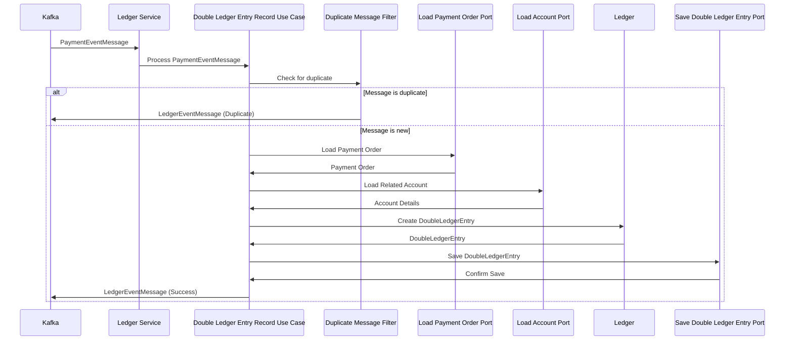

# Ledger Service 구축하기

## Ledger Service 가 필요한 이유

매 거래마다 장부에 기록함으로써 결제 거래 내역을 추적할 수 있다.  
이를 통해 금액 문제가 발생했을 때 해결할 수 있는 근거를 마련할 수 있다.  
기록을 할 땐 다음과 같이 돈을 얻은 쪽과 잃은 쪽 모두 기록하는 Double-Entry Ledger 기법을 사용해서 기록하면 된다.

## 데이터 모델링

### Ledger Entry

| name           | type                        | description    |
|----------------|-----------------------------|----------------|
| id             | BIG INT, PK, AUTO INCREMENT | 장부 고유 식별자      |
| amount         | BIGDECIMAL                  | 금액             |
| type           | ENUM (’CREDIT’, ‘DEBIT’)    | 입금/출금 구별       |
| account_id     | BIG INT, FK                 | 거래가 발생한 계정 식별자 |
| transaction_id | BIG INT, FK                 | 거래의 식별자        |
| created_at     | DATETIME                    | 장부가 생성된 날짜     |

### Ledger Transaction

| name            | type                        | description                |
|-----------------|-----------------------------|----------------------------|
| id              | BIG INT, PK, AUTO INCREMENT | 장부 거래에 대한 고유 식별자           |
| description     | VARCHAR                     | 거래에 대한 설명이나 주석             |
| reference_type  | VARCHAR                     | 참조된 엔티티의 종류 (e.g 주문, 고객 등) |
| reference_id    | BIG INT                     | 거래가 참조하는 외부 엔티티의 식별자       |
| order_id        | VARCHAR                     | 거래와 관련된 주문 식별자             |
| idempotency_key | VARCHAR                     | 중복 장부 기입을 막기 위한 멱등성 식별자    |
| created_at      | DATETIME                    | 거래가 생성된 날짜                 |

### Account

| name | type                        | description |
|------|-----------------------------|-------------|
| id   | BIG INT, PK, AUTO INCREMENT | 계정 식별자      |
| name | VARCHAR                     | 계정 이름       |

## Sequence Diagram

- (1) **Kafka ↔ LedgerService**: Ledger Service 에서는 Kafka 로부터 결제 승인 완료를 알리는 PaymentEventMessage 를 가져온다.
- (2) **LedgerService → DoubleLedgerEntryRecordUseCase**: Ledget Service 는 장부 기입을 DoubleLedgerEntryRecordUseCase 에 위임한다.
- (3) **DoubleLedgerEntryRecordUseCase → DuplicateMessageFilterPort**: 장부에 중복으로 기입하는 걸 방지하기 위해 이미 처리한 적있는 메시지인지 확인한다.
- (4-1) **DoubleLedgerEntryRecordUseCase → Kafka**: 이미 처리한 메시지인 경우, 장부 기입을 건너뛰고 LedgerEventMessage 를 Kafka 에 발행한다.
- (4-2) **DoubleLedgerEntryRecordUseCase → LoadPaymentOrderPort**: 처음 받는 이벤트 메시지라면, 장부 기입을 위해 결제 주문 내역을 조회한다.
- (5) **DoubleLedgerEntryRecordUseCase → LoadAccountPort**:거래 종류에 따라 장부에 기입할 계정을 조회한다.
- (6) **Ledger** **Business logic**: 비즈니스 로직을 수행해서 장부에 기입될 Double Entry Ledger 를 생성한다.
- (7) **DoubleLedgerEntryRecordUseCase → SaveDoubleLedgerEntryPort**: 생성된 Double Entry Ledger 를 데이터베이스에 반영한다.
- (8) **DoubleLedgerEntryRecordUseCase → Kafka**: 장부 기입 완료를 알리는 이벤트 메시지를 Kafka 에 발행한다. 이후 Payment Service 는 이 메시지를 받아서 결제 처리를 마무리한다.

## 무결성 검사를 위한 Database Trigger 구축하기

장부를 통한 거래 추적은 장부가 정확하게 기입되었을 때만 가능하다. 만약 장부 자체가 잘못 기입 되었다면 거래 추적은 불가능하다.  
따라서 장부에 정화하게 기록하는 것은 매우 중요하다.

올바른 장부 기입 시 고려해야 할 검사는 Double Entry 방식을 사용해서 입금과 출금이 동시에 기입될 때 각 항목에 기입된 금액의 합이 0이 되어야 한다는 원칙을 적용하는 것이다.  
그리고 한 번 장부에 기록된 후에는 장부는 불변성을 유지하는 것도 중요하다.

이러한 원칙을 준수하기 위해서 데이터베이스 트리거를 사용할 수 있다.  
트리거는 데이터베이스 테이블에서 DML (INSERT, UPDATE, DELETE) 작업이 발생할 때 자동으로 실행되는 객체로, 유효성 검사에 활용될 수 있다.

## Wallet Service 처럼 메시지 처리와 메시지 전달을 보장해야한다

Ledger Service 또한 이벤트 기반 아키텍처이기 때문에, 메시지 처리는 보장해야하고, 메시지 전달 과정에서 누락은 발생하면 안된다.  
따라서 Wallet Service 처럼 Dead Letter Queue 와 Kafka Transaction 을 적용해서 신뢰성을 보장하는 것이 중요하다.