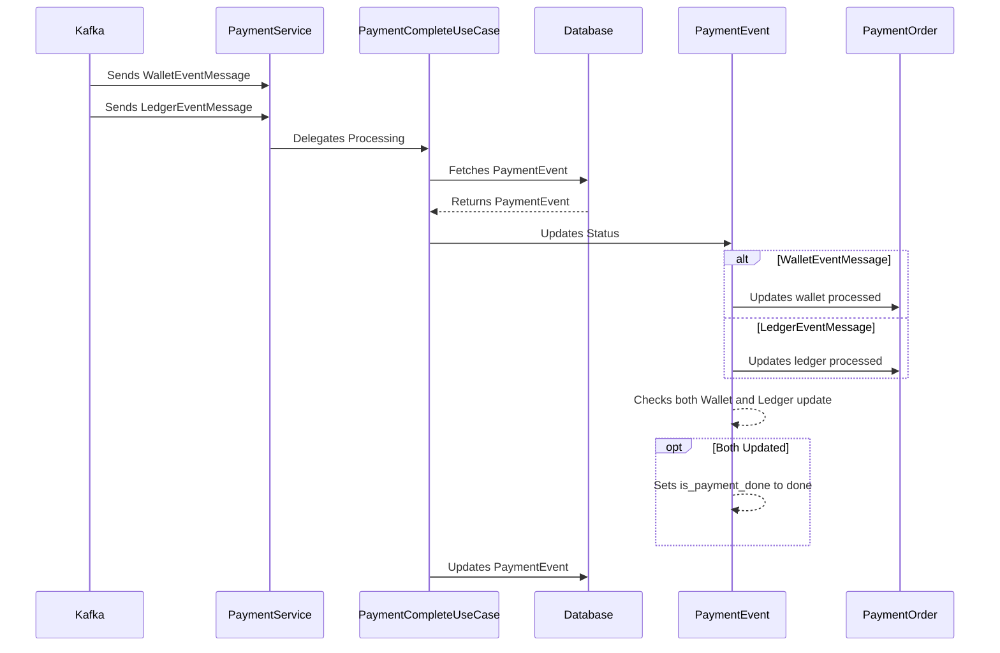

# 결제 완료 기능 구현

정산 처리가 끝나고, 장부 기입이 끝나면 이제 Payment Service 는 결제는 완료시킬 수 있다.  
추가적인 후속 처리가 없다 는 가정하에. Payment Service 는 각 작업의 완료를 나타내는 이벤트 메시지를 수신해서 결제 완료 작업을 처리할 것이다.  
이 작업은 장부 처리 여부를 나타내는 ledger_updated 필드와 정산 처리 여부를 나타내는 wallet_updated 필드를 true 로 변경할 것이고,  
두 작업이 모두 완료되었다면 결제 완료 여부를 나타내는 is_payment_done 필드를 true 로 업데이트 할 것이다. 

## Sequence Digram

**(1) Kafka → PaymentService**:

- Payment Service는 Kafka 로부터 WalletEventMessage(정산 처리 성공 메시지)와 LedgerEventMessage(장부 기입 성공 메시지)를 가지고 온다.

**(2) PaymentService → PaymentCompleteUseCase:**

- PaymentService는 결제 완료 기능을 PaymentCompleteUseCase 에게 위임한다.

**(3) PaymentCompleteUseCase ↔ Database:**

- PaymentCompleteUseCase는 PaymentEvent 를 데이터베이스에서 가져온다.

**(4) PaymentCompleteUseCase → PaymentEvent:**

- 가져온 이벤트 메시지가 WalletEventMessage 면, 정산 처리가 완료되었다고 업데이트한다.
- 가져온 이벤트 메시지가 LedgerEventMessage 면, 장부 기입 처리가 완료되었다고 업데이트한다.

**(5) Payment Event Business Logic**

- wallet 과 ledger 모두 처리되었다면, 결제가 완료되었다는 의미인 is_payment_done도 업데이트 처리한다.

**(6) PaymentCompleteUseCase → Database:**

- 업데이트 된 상태인 PaymentEvent 를 Database 에 반영한다.

## 결제 완료 동시성 문제 제어하기

Payment Service 가 정산 처리와 장부 기입이 완료됐음을 각각 나타내는 WalletEventMessage 와 LedgerEventMessage 를 동시에 수신해서 결제 완료 작업을 수행하는 경우를 고려해보자.

Payment Service 는 데이터베이스에서 초기 상태의 Payment Event 를 가져와서 각각 `wallet_updated` 와 `ledger_updated` 를 true 로 변경시킬 것이다.

그러나, 문제는 Payment Event 에서 `wallet_updated` 와 `ledger_updated` 가 모두 true 로 변경되었음에도 불구하고, `is_payment_done` 필드는 true 로 업데이트 할 수 없는 경우가 발생한다는 점이다. `wallet_updated` 를 true 로 업데이트 할 때는 아직 `ledger_updated` 를 false 라고 간주하고, `ledger_updated` 를 true 로 업데이트 할 떄는 아직 `wallet_updated` 를 false 라고 간주할 것이기 때문이다.

이와 같은 동시성 문제는 데이터베이스 트리거를 사용해서 해결할 수 있다.  
`ledger_updated` 와 `wallet_updated` 의 상태가 변경될 때마다 트리거는 결제가 완료될 수 있는지 검사하는 작업을 수행함으로써 문제를 해결할 수 있다.